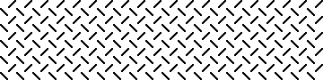

# "The *Drosophila* Time Series Data Model"

Release 0.1

Björn Brembs

License: CC-BY	

# 1. Data Model

The Drosophila Time Series (DTS) Data Model describes single time series experiments which are grouped into projects. Project files contain data items that are exclusively meta-data. The YAML project files contain the grouping information linking each experiment to the project, as well as a project description and experimental comments. These files also contain information about which type of evaluation the project was designed to be used with. Experiment files contain a meta-data header in XML and time series data in CSV.

##  1.1. Data items in Experiment files

Data items in experiment files are arranged in classes: Time series (raw data), experiment sequence and experiment (meta-data). The time series class contains continuously recorded values throughout the experiment. The experiment sequence class contains the data pertaining to the different stages or periods of the experiment. These data can be either recorded during the experiment or determined at the beginning of the experiment. The experiment class contains the meta-data for each experiment as stored in the header of each data file.

### 1.1.1. Definitions

<table>
  <tr>
    <td>int8, int16, int32, int64</td>
    <td>A signed integer occupying 8, 16, 32, or 64 bits in memory.</td>
  </tr>
  <tr>
    <td>uint8, uint16, uint32, uint64</td>
    <td>An unsigned integer occupying 8, 16, 32, or 64 bits in memory.</td>
  </tr>
  <tr>
    <td>Bool</td>
    <td>A truth value that is either True or False.</td>
  </tr>
  <tr>
    <td>float32</td>
    <td>An IEEE single-precision floating point number, occupying 32 bits in memory.</td>
  </tr>
  <tr>
    <td>float64</td>
    <td>An IEEE double-precision floating point number, occupying 64 bits in memory.</td>
  </tr>
  <tr>
    <td>label 
</td>
    <td>A text string in ASCII encoding containing at most 32767 characters which are each an upper or lower case letter, a digit, or one of the punctuation characters in the string "!#$%&?@^_~+-*/=,()[]”’. This includes all the ASCII punctuation characters except for the dot. Spaces and control characters are not allowed.</td>
  </tr>
  <tr>
    <td>List</td>
    <td>An ordered collection of items. Corresponding data structures in programming languages are typically called list, vector, or array.</td>
  </tr>
</table>

### 1.1.2. Data item type "metadata"

The **metadata** data item contains all the data relevant for the entire experiment. 

An **experiment_metadata** data item contains the following fields:

* A **license** field

* A **URIs** field with

    * **recording** - the persistent URI of the software used to record the data

    * **analysis** - the persistent URI of code to analyze the data

    * **datamodel** - persistent URI linking to the relevant version of this document

* An **experimenter** field with

    * **firstname**

    * **lastname**

    * **orcid **(possibly empty)

* A **fly** field with the *types *"strain" or “cross”

    * A **name** field. An identifier string. Lower case characters with ., _, - and / are allowed. This is ideally a url-usable and human-readable name, unique for each fly

    * A free text **description** of the fly strain

    * A **flybase** field with the flybase ID for the stock (for "strain").

    * An **m_parent** field with the flybase ID for the male parent (for "cross")

    * An **f_parent** field with the flybase ID for the male parent (for "cross")

* An **experiment** field with the *type *of either "torquemeter", or “joystick” with

    * A **dateTime** denoting the start of the experiment, yyyy-mm-ddThh:mm:ss

    * A **duration** field denoting the total duration of the experiment, in seconds

    * A **description** field with a free text description of the experiment

    * A **sample_rate** field with the sampling rate in Hz

The **experiment** *type *"torquemeter" allows the following additional fields

* An **arena_type** field specifying "motor", “pingpongball” or “lightguides” as arena type

* A **meter_type** field specifying the type of torque meter used. Either the old Karl Götz compensator (Goetz), Tang Shiming’s uncompensated device (Shiming), Reinhard Wolf’s thread device (Wolf) or our own device (Brembs).

The **experiment** *type *"joystick" allows the following additional fields

* A **lighting** field specifying total darkness (0) or white illumination (1).

### 1.1.3. Data item type "sequence"

The **sequence** data item describes the different phases or periods of the experiment. It contains a list of periods into which the experiment has been divided. The number of periods is specified at the declaration of the sequence. Each period receives a sequential **number** and a **type**:

fs	negative feedback between torque and visual pattern. Patterns defined in "arena"

inv_fs	inverted coupling, otherwise like fs

optomotorR	recording optomotor responses, clockwise panorama rotation, Patterns defined in "arena". All optomotor periods must have the same duration

optomotorL	recording optomotor responses, counter-clockwise panorama rotation. All optomotor periods need must the same duration

sw	switch-mode in which one of two colors (defined in "arena") is associated with a ‘right’ yaw torque domain and the other with ‘left’. Each color covers an otherwise empty arena.

yt	yaw torque recording, no external stimuli

color	fs-type operant color learning with a striped arena, necessitating angle integration

class_cola	Classical conditioning with rotating stripes and colors, necessitating angle integration

class_patt	Classical conditioning with patterns

class_col	Classical conditioning with colors only, no patterns

yoke	Replay experiment. These periods contain additional parameters, such as the yoked_variables parameter with a comma-separated list of "a_pos", “outcome” or “color” to denote which variable(s) were yoked, “period” for the number of the period it was yoked to, and the field “yoked_filename” containing the filename of the experiment it was yoked to.

These parameters describe the period:

duration	The duration of each period in seconds

outcome	Boolean. Whether an outcome (e.g., heat) was applied or not.

arena	The visual pattern or color shown during the period. Either 0 for none (white) or a number corresponding to the pattern/color in the pattern/color collection (see 3. Arena)

coup_coeff	Coupling coefficient either 0 for no direct coupling or in degrees per second and 
10-10Nm

contingency	The condition upon which the outcome is made contingent. Quadrants in angular position (a_pos) are labelled either "1_3_Q" or “2_4_Q” with 1 denoting the quadrant with the zero position in the center. Torque domains are labelled “right_torque” (positive torque values) or “left_torque” (negative torque values) and colors “green” or “blue”.

### 1.1.4. Data item type "timeseries"

The **timeseries** data item contains the raw time series data in CSV, as well as a description of the recorded variables. 

The **CSV_descriptor** describes which dialect of CSV is used in the time series raw data. The descriptor contains any of the following fields:

Delimiter	Specifies the character used to delimit fields

doubleQuote	Boolean. If set to ‘true’ two consecutive quotes must be interpreted as one

lineTerminator	Specifies the character sequence that must be used to terminate rows

quoteChar	Specifies a one-character string to use as the quoting character

skipInitialSpace	Boolean. Specifies the interpretation of whitespace immediately following a delimiter. If false, whitespace immediately after a delimiter should be treated as part              of the subsequent field

header	Specifies if the file includes a header row, always as the first row in each variable.

caseSensitiveHeader	Boolean. Specifies if the case of headers is meaningful.

escapeChar	Specifies a one-character string to use as the escape character

nullSequence	Specifies the character sequence denoting empty cells, e.g., NaN

The **variables** always start with time and one or more of the other variables. Each variable is numbered and listed in the order the columns appear below the end tag.

time	Either as timestamp, as time since start of the experiment, or time between samples. Units may be seconds [s], milliseconds [ms] or timestamp [timestamp].

period	Period [number]

torque	Torque of a fly at the torque meter, usually in arbitrary units [arb_unit] or 10-10  Nm [mdyncm]

a_pos	Angular position of an arbitrary point on the fly’s azimuth, usually in 0.1° [dd], i.e., ±1800

j_pos	Joystick position, usually in arbitrary units [arb_unit]

color	Which color was displayed, either 0 for white, 1 for blue, 2 for green or 3 for intermediate daylight in the color catalogue (see 4. Colors). [arb_unit]

outcome	Boolean. Whether the outcome (e.g., heat) was applied or not. 0 – off/false, 1 – on/true [arb_unit]

Each variable is described by 

* A **var_type** field denoting the type and bitrate of the variable

* A **unit** field. Units are "timestamp", “s”, “ms”, “arb_unit”, “mdyncm”, “dd”, “pixel”, “number”

The **CSV_data** tags enclose the raw time series data.

## 1.2. Data items in project files

Project files reside in the same directory as the data files and contain the experimental design of a project by listing the different data files in the experimental groups. While data files are written by software, these project files are written by humans. As YAML is easier to read for humans than XML, data files are in XML and project files in YAML. The syntax loosely follows the Frictionless Data format at [https://specs.frictionlessdata.io/data-package](https://specs.frictionlessdata.io/data-package)

### 1.2.1. Data item type: "experiment"

Each project file starts with the **type **of the experiment (one of ‘torquemeter’ or ‘joystick’), a disambiguating **id **(SSRN, if available), a machine-readable and URL-usable **name** of the experiment, a free text **title** and a free text **description **of the experiment 

### 1.2.2. Data item type "licenses"

The type **licenses** is characterized by a **name** and a **URI** for each license

### 1.2.3. Data item type "author"

The **author **of the project file is contained in the following fields:

name	An identifier string. Lower case characters with ., _, - and / are allowed. This is ideally a url-usable and human-readable name

description	Full name, first and last

firstName	first name

lastName	last name

id	ORCID identifier (may be empty)

### 1.2.4. Data item type "resources"

The **resources **contain the list(s) of the filenames in each experimental group. Each group is charatcerized by the following fields:

name	An identifier string. Lower case characters with ., _, - and / are allowed. This is ideally a url-usable and human-readable name

title	Free text of the fly strain used

id	one line for each FlyBase ID, i.e., two lines for a cross, one for a fly line with identical parental lines, or empty if no ID

description	Free text describing the kind of experimental group, i.e., "experimental", “control” or variants thereof. In a typical three-group scenario, identical descriptions of two groups will lead to pooling of data in these groups. Use of “test” or “experimental” for one of the groups will lead to statistical comparison of this group against both others.

data	list of file names (incl. .xml extension) with each name in a separate line. Comment character ‘#’.

### 1.2.5. Data item type "statistics"

The data item type **statistics **contains the information which statistical tests to perform and several important parameters to be set by the user prior to statistical analysis. It is defined by the following fields:

significance levels	usually three floating point values, one in each line for marking figures with either n.s., or a set of asterisks from one to three asterisks.

priors	two priors for false positive risk calculation, one per line

color-range	Color names (one per line) from the R colorspace for boxplot coloring

learning score	Describes which period should be analyzed statistically. **Name **is a short label, **description **a free-text description of the chosen period and **data **is the number of the period (integer).

single-groups	Collects some parameters for testing single groups against zero. Can be used with any number of groups. The **title **is a short free-text field, **description **is a free-text description of the test(s) performed and **data **is a boolean  (0: FALSE, 1: TRUE) of whether the tests should be performed.

two.groups	Collects some parameters for testing two groups against each other for differences. Only defined for two experimental groups in ‘resources’ or if there are only two unique group ‘resources/description’, in which case the different groups will be pooled into those with identical ‘resources/description’.  The **title **is a short free-text field, **description **is a free-text description of the test(s) performed, **power **specifies if the post-hoc statistical power calculation should be done with the first group expected to be higher (‘greater’) or lower (‘less’) than the second group, or two-sided (‘two.sided’). The **data field **is a boolean  (0: FALSE, 1: TRUE) of whether the analyses should be performed.

three.groups	Collect parameters for a pair of two-group tests. Only defined for exactly three experimental groups, with one group ‘resources/descriptions" containing "test” or “experimental”. In this case, the test/experimental group is tested against each of the other two groups.  The **title **is a short free-text field, **description **is a free-text description of the test(s) performed, **power **specifies if the post-hoc statistical power calculation should be done with the first group expected to be higher (‘greater’) or lower (‘less’) than the second group, or two-sided (‘two.sided’). The **data field **is a boolean  (0: FALSE, 1: TRUE) of whether the analyses should be performed.

### 1.2.6. Data item type "mediatype"

Descriptor of media type. Either  text/csv/xml or text/yaml
### 1.2.7. Data item type "finished"

Empty field. Presence or absence indicates that the project is concluded or not and is used to create a permanent identifier when published.

### 1.2.8. Data item type "epid"

Integer value that is created automatically by the synchronization procedure that publishes the projects.

# 2. Values for the ‘arena’ parameter in data files

## 2.1. Patterns

The left edge of the patterns denotes -180° of a_pos, the center 0° and the right edge 180°. Default color for patterns 1 through 6 is a white background (RGB: 255,255,255, hex#ffffff). The numbers for each case correspond to the integer values entered in the ‘arena’ field of the ‘sequence’ data type in data files.

During interchanges between color and visual patterns the background color should always be reset to a white background (RGB: 255,255,255, hex#ffffff)

1. No pattern/color, white. Allows contingencies: "none", “right_torque”, “left_torque”

2. Single vertical dark stripe, width 6°, 90° height, white background

3. Striped drum, pattern wavelength 24° (i.e., 15 evenly spaced stripes), 90° height, white background. Allows contingencies: "none"

4. Four T-Patterns in the center of each quadrant, width 40°, height 40°, barwidth 14°, white background

5. Four identical stripes in the center of each quadrant, width 14°, height 40°

6. Evenly spaced diagonals, 9°x9°

7. Green on ‘right’ (positive) torque, blue on ‘left’ (negative) torque, no visual patterns

Green: #2; Blue: #3 

8. Blue on ‘right’ (positive) torque, green on ‘left’ (negative) torque, no visual patterns

Green: #2; Blue: #3

9. Constant daylight

Daylight: #4

## 2.2. Colors

Catalogue of colors used in time series experiments as referenced in ‘patterns’ above. Colors are given in spectra and in RGB/Hex codes. 

1. White (projector): (255,255,255), #ffffff

2. Green (0,255,0), #00ff00

3. Blue (0,0,255), #0000ff

4. Daylight (0,255,255) #00ffff

Spectra of Green (#2) and Blue (#3) coloration as measured in the arena.
